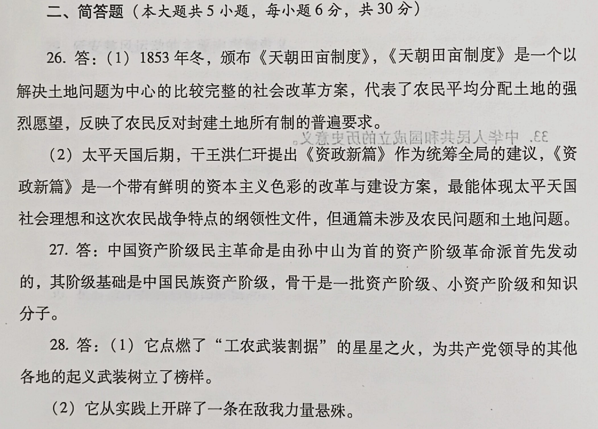
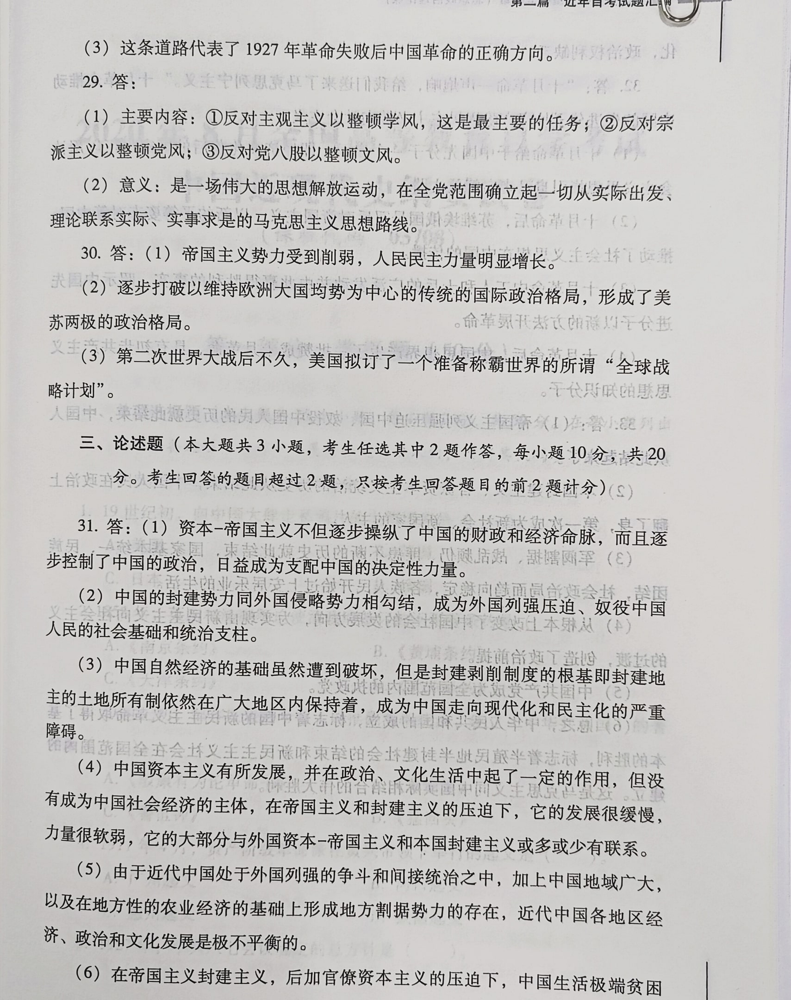
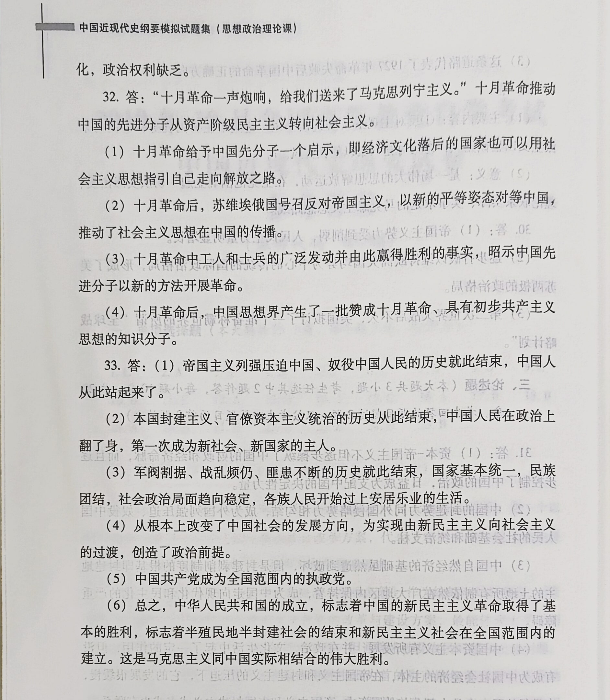

一、单项选择题

1\.1861年，清政府设立的综理洋务的中央机关是（）

C．总理各国事务衙门

2．戊戌维新时期，维新派在上海创办的影响较大的报刊是（）

A.《时务报》

3．在1911年爆发的保路运动中，规模最大、斗争最激烈的省份是（）

A.四川

4．中国历史上第一部具有资产阶级共和国宪法性质的法典是（）

D.《中华民国临时约法》

5．国民党在全国统治建立后，官僚资本的垄断活动首先和主要是（）

D.从金融业方面开始的

6\.1933年5月，在张家口领导成立察哈尔民众抗日同盟军的国民党爱国将领是

C.冯玉祥

7\.1935年，日本帝国主义为扩大对华侵略而制造的事变是（）

B.华北事变 

8\.1936年10月，中国工农红军第一、二、四方面军胜利会师于（）。

D.甘肃会宁、静宁地区

9\.1947年10月10日，《中国人民解放军宣言》正式提出的口号是（）。

C.打倒蒋介石，解放全中国

10\.1949年4月21日，中国人民解放军发起的重大战役是（）

D.渡江战役

11\.1956年召开的中共八大指出，党和全国人民当前的主要任务是（）

C.把我国从落后的农业国变为行进的工业国

12\.1959年，在中共中央召开的庐山会议上受到错误批判的是（）。

A.彭德怀

13\.1962年年初，中共中央为总结经验教训、明确工作方向召开的会议是()。

B.“七千人大会＇ 

14\.1964年，新中国取得的重大科技成就是（）

A.第一颗原子弹试验成功

15．新中国恢复在联合国合法席位的时间是（）

C．1971年

16．中国进入改革开放和社会主义现代化建设新时期的历史起点是（）

A.中共十一届三中全会

17．邓小平在1979年3月的理论工作务虚会上首次明确提出，必须坚持（）

B.四项基本原则

18\.1984年，中共十二届三中全会通过的重要文件是（）。

B.《关于经济体制改革的决定》

19\.1988年，七届全国人大一次会议决定设立的经济特区是（）。

A.海南经济特区 

20\.2005年，十届全国人大三次会议通过的法律是（

D.《反分裂国家法》

21．中共十八大提出，我国到2020年的奋斗目标是（）

D.全面建成小康社会

22\.2013年11月，审议通过《关于全面深化改革若干重大问题的决定》的会议是

C.中共十八届三中全会

23．中共十九大强调，习近平新时代中国特色社会主义思想的核心要义是(

B.坚持和发展中国特色社会主义

24．中共十九大明确指出，我国社会主要矛盾已经转化为（）。

D.人民日益增长的美好生活需要和不平衡不充分的发展之间的矛盾

25\.2010年以来，中国已经成为世界（）

B.第二大经济体

二、简答题

26．太平天国定都天京后先后颁布的两个社会改革方案及其特点。

27．辛亥革命时期中国资产阶级革命派的阶级基础和骨干力量。

28．井冈山农村革命根据地创建的历史意义。

29．延安整风运动的主要内容和意义。

30．抗日战争胜利后的国际格局。

三、论述题

31．近代中国半殖民地半封建社会的特点。

32．俄国十月革命对中国革命的影响。

33．中华人民共和国成立的历史意义。

