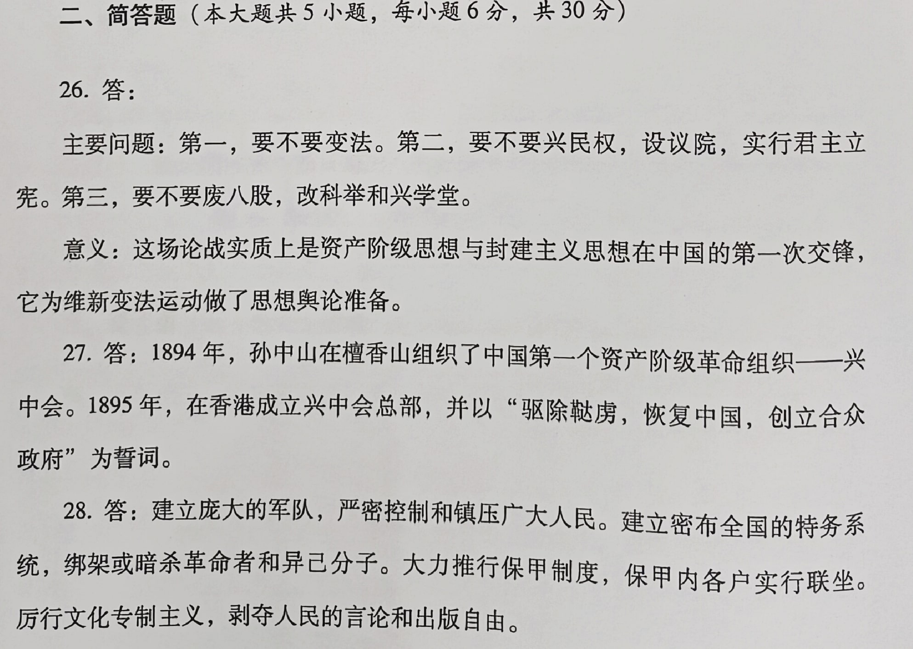
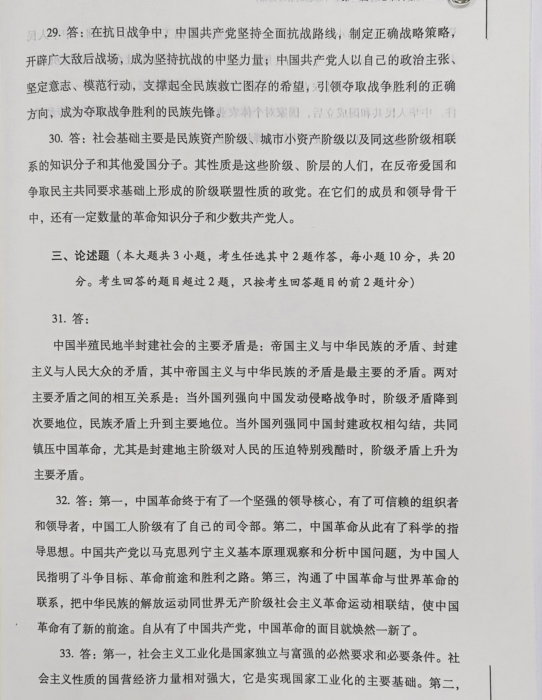
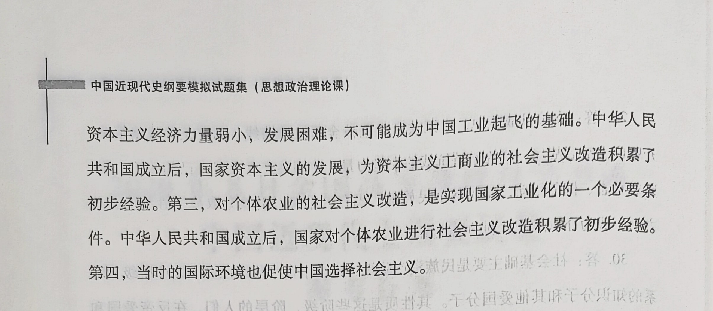

一、单项选择题

1\.19世纪初，向中国大肆走私鸦片的主要国家是

B.英国 

2\.1858年，英国和法国等迫使清政府签订的不平等条约是

C.《天津条约》

3\.20世纪初，邹容发表的号召人民推翻清朝统治、建立“中华共和国”的著作是（

B.《革命军》

4\.1911年4月，资产阶级革命派在黄兴带领下举行的起义是（

A.广州起义

5\.1927年，中共八七会议确定的总方针是（

D.开展土地革命和武装斗争

6\.1931年1月至1935年1月，中国共产党内出现的主要错误倾向是（

D.“左”倾教条主义

7\.1933年11月，国民党爱国将领蔡廷锴和蒋光鼐等发动的抗日反蒋事件是(

B.福建事变 

8\.1935年，中国共产党提出抗日民族统一战线新政策的会议是（

A.瓦窑堡会议

9\.1946年6月，国民党军队挑起全面内战的起点是（

C.大举围攻中原解放区

10\.1949年3月，毛泽东在中共七届二中全会上明确提出了（

D.“两个务必”的要求

11．在中共八大上，陈云提出的重要思想是（

C.“三个主体，三个补充” 

12\.1962年年初，中共中央为统一思想、总结经验教训和明确工作方向而召开的会议是（ ）。

D.“七千人大会” 

13\.1964年，中华人民共和国取得的重大科技成果是（

A.第一颗原子弹试验成功

14\.1967年，老一辈革命家与中央文革小组错误做法进行的抗争被诬称为

B.“二月逆流”出大八十共中.

15\.1971年10月，中华人民共和国在外交上取得的重大成果是（）

C.恢复了在联合国的合法席位

16．揭开我国社会主义改革开放序幕的会议是（

A.中共十一届三中全会

17\.1984年，中共十二届三中全会通过的重要文件是（

B.《关于经济体制改革的决定》

18\.1988年，中共中央和国务院决定建立的经济特区是（

C.海南经济特区

19．中国共产党明确提出我国建立社会主义市场经济体制目标的会议是

B.中共十四大 

20\.2005年，第十届全国人民代表大会第三次会议通过的法律是（

D.《反分裂国家法》

21\.2010年以来，中国已经成为（

B.世界第二大经济体

22．中共十八大提出，我国到2020年的奋斗目标是（）。

A.全面建成小康社会

23．中共十九大强调，习近平新时代中国特色社会主义思想的核心要义是(

A.坚持和发展中国特色社会主义 

24\.2014年2月，十二届全国人大常委会第七次会议确定的中国人民抗日战争胜利纪念日是

C．9月3日

25．中国共产党明确提出中国特色社会主义进入新时代的会议是（

D.中共十九大

二、简答题

26\.19世纪末，维新派与守旧派论战的主要问题及意义。

27．兴中会的成立及其誓词。

28．大革命失败后国民党政府实行军事独裁统治的主要表现。

29．中国共产党的中流砥柱作用是中国人民抗日战争胜利的关键。

30．中国各民主党派形成时的社会基础及其性质。

三、论述题

31．中国半殖民地半封建社会的主要矛盾及其相互关系。

32．中国共产党成立的历史意义。

33．中国共产党提出的过渡时期总路线反映了历史的必然。

