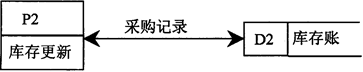
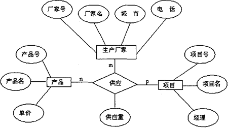

**02376信息系统开发复习题**

1、信息资源管理经历了3个发展阶段：20世纪70年代到20世纪末被称为信息管理阶段，它的特征是									                	   

` `以计算机应用和数据处理为典型代表

2、对信息的正确理解是	 										 

` `信息是加工处理后的数据

3、以下不属于生命周期法特点的是								  

. 强调尽早开始编程	       

4、以下关于原型法的描述中，错误的是								  

. 要求对原系统进行全面的调查和分析

5、模块的控制耦合是指											  

. 上下级模块之间传递控制信号     

6、对客户记录进行标记，符合条件的标为“T”，不符合条件的标为“F”，最适于采用的模块结构是														  

` `选择结构

7、以下描述中符合“结构化设计”思想的是  						 

. 系统模块分解要自顶向下逐步细化	   

8、改正开发期间错误的过程是     								   

` `纠错性维护			

9、帮助系统分析员了解一个组织内部业务处理活动的内容与工作流程的图表是  

. 业务流程图

10、现代管理的核心是                                                   

` `决策          	

11、现代管理信息系统是                                        		    

` `人和计算机等组成的系统    

12、在系统维护阶段最主要的工作是

` `应用软件维护

13、使用不合理的或错误的数据进行系统测试的目的是保证系统的			 

可靠性

14、系统设计报告应当作为新系统的

. 物理模型				

15、模块的控制耦合是指												

` `上下级模块之间传递控制信号		

16、“教师”实体和“课程”实体之间具有“讲授”关系；每位教师可以讲授1至4门课程，每门课程可由1至3位教师讲授；“教师”和“课程”之间的联系类型是      

. 多对多

17、在信息系统分析中，数据流图反映									  

` `用户操作使用方面的要求

18、以下属于系统设计阶段主要内容的是

` `定义处理过程    			 

19、模块划分的原则是                                                                            

、耦合小，内聚大

20、属于系统安全保护技术的是

数据加密技术					 

21、最难检测的程序错误是

、逻辑错误			

22、系统测试的步骤是

、单元测试、子系统测试、系统测试、验收测试

23、同时具有无逻辑含义和无法插入特点的代码类型是

、顺序码			

24、学生选课系统数据流程图中的“外部实体”可以是

、学生、教师、教务处

25、数据流程图的两个显著特点是

、概括性和抽象性

26、下面的数据流程图中双箭头表示的含义是

P2从D2读出采购记录，处理后写入D2

27、BSP方法中，明确企业发展方向属于

、定义企业目标步骤		

28、微型机的公共外部总线是：地址总线、控制总线和

、数据总线					

29、利用模拟信道传输数字信号的方法称为

频带传输

30、企业外部网Extranet对于外部客户是

半公开的					

31、在一个关系二维表中，非主属性是指

非候选码

32、按用户的观点模拟，又独立于任何数据库管理系统的模型叫做

、概念模型

33、以下关于MIS和DSS的描述中，错误的是

MIS和DSS均强调系统的人机交互性

34、下列系统开发的各阶段中难度最大的是 

` `系统分析    				

35、数据库的组织结构中包括的模式有

前三个选项都对

36、U/C矩阵的正确性检验没有包含的一种是： 

、准确性检验   

37、文件系统中最小的数据存取单位是 

数据项    		

38、某公司把库存物资出入库和出入库财务记账处理综合成一个应用子系统，这种子系统

是将

`  `、供销职能和财务职能关联在一起

39、下列关于结构化方法和原型法的描述错误的是

、	对于运算量大、逻辑性较强的程序模块可采用原型法来构造模型

40、可行性分析的内容包括

经济上的可行性、技术上的可行性、管理上的可行性

41、某企业建立了生产、销售、人事等从基层到高层的MIS，这种MIS的结构为 

`  `、总的综合结构  				

42、数据库系统的核心是 

数据库管理系统  						

43、绘制系统流程图的基础是

`  `、数据流程图     

44、C/S是一种重要的网络计算机模式，其含义是： 

客户/服务器模式  			

45、系统开发过程中的第一个正式文档是

可行性报告

46、下面哪句话最准确地概括了结构化方法的核心思想

、自顶向下，由粗到细，逐步求精

47、参加系统分析的人员不包括

程序员   

48、系统设计时

按逻辑功能划分子系统    			

49、原型化方法一般可分为三类，即

探索型、实验型、演化型

50、比较常见的电子商务模式B2C（或称B to C）是指

、企业与直接个人消费者间的电子商务

51、结构化分析与设计是信息系统开发时常用的方法，按其生命周期特征，它应属于

瀑布模型

52、一个合理的模块划分应该是内部联系

、强  	  

53、业务信息主要提供给企业的（  ）人员使用。

` `基层管理 		

54、数据库的数据都存放在一台计算机中，并由它统一管理和运行的数据库系统称为

` `、集中式系统   

55、在一个关系R中，所有的非关键字字段之间，不存在传递依赖关系，那么我们称它是

第三范式

56、在系统设计中使用U/C矩阵方法的主要目的是 

确定系统子系统的划分

57、下列工作哪些都属于管理信息系统实施阶段的内容？

、 程序设计,设备购买,数据准备与录入

58、系统调试时，当程序全部调试完成后，首先应作的事是 

系统试运行   

59、下列不属于传统的信息系统规划的方法是

MRP

60、计算机设备的购置应在

系统实施阶段

61、下列关于信息的说法正确的是

所有的信息都应该是对客观世界的真实反映 		

62、系统实施中的系统切换方式以下说法不正确的是

分时切换

63、在数据库系统中，数据存取的最小单位是 

、数据项     	

64、计算机辅助软件工程(CASE)的技术目标，是实现(    )基于计算机的自动化。

`  `、系统开发各阶段   

65、在系统开发过程中，企业管理人员直接参与执行的工作包括：系统分析和(   )。

` 	 `、系统运行、评价   

66、新系统的目标和范围的确定工作属于(    )的工作内容。

` `、 总体规划和可行性研究

67、总体规划和可行性研究阶段，进行初步调查的内容有：企业和环境概况和(   )、开展系统开发的资源情况，以及企业领导、各职能部门负责人对系统目标和范围的看法，对系统开发工作的态度。

` 	 `、信息处理状况  

68、系统总体方案中，对系统运行环境的描述，内容包括：系统运行的基本要求及条件；管理思想及管理方法更新的设想；管理体制改革及组织机构；和(   )。

` `、职能调整的设想   

69、事务流程图的描述对象是

`  `一项业务或一组相互关联的业务

70、数据字典中的条目有以下6种形式：数据项；数据结构；数据流；数据存贮；(   )；外部实体。

`  `处理功能     

71、数据流程图是表达系统逻辑模型的主要工具，(   )及各功能的处理逻辑决策树、决策表等可作为其说明和补充。 

`  	`数据字典  

72、每个模块有自身的任务，只有接受到（   ）的调用命令时才能执行

、上级模块  		

73、模块的分解应使每个模块

`  `内部自身联系紧密

74、代码的功能主要表现在两方面：1)它是实体明确的、唯一的标识；2)编码后不仅能简化程序，而且

`  	`处理效率高   

75、在一般信息系统运行中，绝大部分信息错误是产生于

原始数据的采集和输入错误

1、软件测试是为了证明软件的正确性。Í

2、管理科学的狭义理解是运筹学加计算机即用计算机收集信息，用运筹学列出模型，然后再用计算机求解。P

3、系统分析报告所确定的内容是系统实施的基础和依据。P

4、数据流图的逐层分解，属于功能分解性质。P

5、一个合理的模块划分应该是模块间尽可能随意。Í

6、程序调试过程中采用的测试数据只包括正常数据。Í

7、数据流图的逐层分解，属于功能分解性质。P

8、模块之间的耦合形式中内容耦合的联系程度较高。P

9、大部分信息系统的开发工作都能在预定计划中完成。Í

10、人是信息化的社会生产力中最积极、最活跃的因素。P

11、系统开发是系统建设中工作任务最为繁重的阶段。Í

12、系统建设中面临问题的主要原因是缺乏科学的、有效的系统规划。P

13、结构化系统开发方法的每一个阶段都有明确的工作目标。P

14、信息的价值关键在于对数据解释的正确性。P

15、从信息的使用频率来看，越是企业的高层（战略层）信息使用的频率越高。Í

16、对于大系统来说，划分子系统的工作应在系统规划阶段进行。P

17、提高系统可靠性的方法之一是对用户合法身份的确认和检验。P

18、会编写程序就能够开发管理信息系统。Í

19、现代企业进行业务流程重组一般需要有信息技术的支持。P

20、一个组织内各部门的信息需求在范围、内容、详细程度和使用频率等方面有差别。P

21、在系统切换方式中，直接切换方式比较适合设备和人员培训费用较少、属于低风险的方式。Í

22、实体代码的设计与程序的编写都是在系统设计阶段完成的。Í

23、信息系统的逻辑模型要解决系统“干什么”，同时也要解决系统“如何干”等问题。Í

24、业务流程分析主要是为了描述现行系统的物理模型。P

25、巧合内聚是指模块内各成份之间的联系紧密。Í

1、MIS生命周期：指管理信息系统的系统规划、系统开发、系统运行与维护与系统更新的过程。

2、模块化：把系统划分为若干模块，每个模块完成一个特定的功能，然后将这些模块汇集起来组成一个整体，用以完成指定功能的一种方法。

3、调试：指准确判定错误位置以及具体的出错情况，继而进行改正以排队错误。

4、信息系统安全性：为了保护信息系统不受来自系统外部的自然灾害和人为的破坏，防止非法使用者对系统信息及资源的非法使用而采取的安全保密手段。

5、可行性研究：对系统的执行性规划进行审定，评价解决问题的设想和方案，提出可行性分析的结论。

6、数据词典: 是指对数据的数据项、数据结构、数据流、数据存储、处理逻辑、外部实体等进行定义和描述，其目的是对数据流程图中的各个元素做出详细的说明。

7、子类：由基类派生按用户要求，自定义的类。

8、(数据流程图的)抽象性：以现状调查的文档为依据，但摆脱了实际问题的限制；在设计时抽去了具体的物理内容和处理细节，只描述数据的来源、流向、处理功能和数据存储。

9、OSI：开发系统互联参考模型，是一个逻辑结构，称为网络七层协议。

10、系统的可维护性：是指对系统进行维护的难易程度的度量，其中包括有：①可理解性：指为外来读者理解系统的结构、接口、功能和内部过程的难易程度。②可测试性：指为系统进行诊断和测试的难易程度。③可修改性：指对系统各部分进行修改的难易程度。

11、数据词典：DFD中所有成分的定义和解释的文字结合，其描述的主要内容有：数据流、数据元素、数据存储、加工、外部项等。 

12、系统测试：是保证系统质量与可靠性的最后关口，对整个系统开发过程包括系统分析、系统设计和系统实现的最终审查。

13、数据加密：为了防止存储介质的非法拷贝、被窃，以及信息传输线路的被窃听而造成机要数据的泄密，在系统中应对机要数据采取加密存储和加密传输等安全保密技术措施。

14、单元测试：也称模块测试。单元是程序最小的独立编译单位。

15、信息：事物之间相互联系、相互作用的状态的描述。

16、信息化：是指人们的信息活动的规模不断增长以至在国民经济中占主导地位的过程。

17、结构化方法：指信息系统的一种开发方法，其主要含义是一组规范的步骤、准则和工具来进行开发工作。

18、CASE技术：指计算机辅助软件工程或计算机辅助系统工程。

19、系统结构图：描述模块的层次结构和它们之间的控制通信联系的工具。

20、对象：是问题空间的事物的抽象体。

21、消息：对象之间进行通信的数据。

22、封装：是对所有对象的内部软件范围的边界进行界定，对各对象之间相互作用的接口进行描述，对每个对象的内部实现进行保护。

23、消息传递：指当一个消息发送给某个对象时，包括要求接收对象去执行某些活动的信息，接收到消息的对象经过解释，然后邓以响应的通信机制。

24、服务：指某个对象所具有的特定的行为。

25、属性：是描述对象或分类结构实例的单元。

1、为什么要进行数据流程分析？

2、信息系统开发前应做的准备工作有哪些？

3、软件测试包括哪些步骤？说明这些步骤的测试对象是什么？

4、信息系统开发的管理模型有哪些?

5、简述需求分析的目的。

6、简述信息的主要特性。

7、说明结构化设计与系统可修改性之间的关系。

8、说明决策树在系统功能描述中的作用和特点。

9、试述战术信息的特点及主要内容。

10、试述管理信息系统生命周期的意义及阶段划分。

11、简述管理信息系统的物理组成。

12、简述管理信息系统中计算机系统方案评价的依据。

13、简述信息资源的主要内容。

14、管理信息系统建设的复杂性主要表现在哪些方面

15、简述系统分析阶段中，可行性研究活动的目标和要解决的关键问题

16、简述数据存储总体结构设计的主要原则。

17、简述数据流图的基本组成。

18、简述代码及其作用。

19、简述信息系统实体安全性的主要内容

20、简述管理信息系统的层次结构。

21、简述管理信息系统集中式结构的主要优点。

22、试述在关系数据库设计中，规范化二维表的性质。

23、简述决策支持系统的特点。

24、简述系统分析需用信息的类型。

25、简述系统可靠性技术的主要类型。

解：

1、解答：（1）准确了解企业管理活动的全过程，分析出各种管理活动的实质和相互间的关系，（2）数据是信息的载体，是我们正在开发的管理信息系统的主要对象，（3）为今后建立新系统逻辑模型，以及数据库结构和功能模块设计打下基础。

2、解答：为确保管理信息系统的开发更有效，在系统开发前应充分做好准确工作，主要包括：（1）借鉴同类系统的开发经验，（2）确定系统目标、开发策略和投资金额，，（3）收集和整理基础数据。

3、解答：（1）单元测试：测试对象对单元模块（2）集成测试：测试对象为组装后的程序模块（3）确认测试：测试对象为可运行的目标软件系统（4）系统测试：测试对象为计算机系统的各组成部分。

4、解答：（1）综合管理模型（2）生产计划管理模型（3）库存管理模型（4）财务成本管理模型（5）财务成本管理模型（6）统计分析与预测模型。

5、解答：（1）需求分析的目的就是要搞清楚用户的想法和要求，。（2）总体需求分析也称为总体规划，主要目的是明确未来系统“是什么”的问题，（3）详细需求分析也称系统分析，主要明确“干什么”的问题。 

6、解答：（1）可传输性：信息可脱离信源进行传输并不影响信息的内容（2）可存储性：可借助载体在一定的条件下存储，为信息积累、加工、应用提供可能（3）可加工性：（4）可通过一定的手段加工（5）共享性：一个信源的信息可为多个接收者享用 （6）时滞性 ：信息从信源到接收者要经过一段时间

7、解答：（1）系统可修改性与系统结构关系密切（2）组成系统的各部分之间有信息联系，合理的物理结构可以使各部分间波动效应降到最低（3）系统的结构复杂，需要合理的物理结构，结构化设计可以提高系统的可修改性。

8、解答：（1）是一种树状图形工具，可对数据流程图中处理过程的逻辑判断功能进行描述（2）可以描述多种策略和条件下的处理关系（3）优点是清晰、直观，缺点是条件较多且相互组合时，描述不够清楚。

9、解答：（1）供中级管理人员（2）完成计划编制、资金分配时使用（3）包括各种固定信息、历史情况与现状信息、以及部分具体的外部信息。

10、解答：（1）管理信息系统产生发展、成熟和更新换代的过程称为管理信息系统的生命周期（2）可分为四大阶段：系统规划、系统开发、系统运行与维护和系统更新（3）系统开发阶段又可分为系统分析、系统设计与系统实施三个阶段。

11、解答：（1）计算机硬件系统(2)计算机软件系统(3)数据及其存储介质(4)通信系统(5)非计算机系统的信息收集、处理设备(6)规章制度 

12、解答：（1）是否满足所有的功能要求，并考虑到了今后的发展（2）配件是否齐全（3）软件是否丰富（4）技术是否先进（5）后援是否可靠（6）系统是否开发。

13、解答：（1）信息资源通常包括：信息（消息、知识、技术）及其载体；（2）信息采集、传输、加工、存储的各类设施和软件；（3）制造上述硬、软件的设施；（4）有关信息采集、加工、传输、存储、利用的各种标准、规范、规章、制度、方法、技术等。

14、解答：（1）建设环境的复杂性（2）用户需求的多样性（3）建设内容的复杂性（4）技术手段的复杂性（5）建设需用资源的密集性。

15、解答：（1）目标是：进一步明确系统的目标、规模和功能，提出拟开发系统的初步方案和计划（2）要对系统的规模、目标及有关约束条件进行论证，并提出系统的逻辑模型及可能的方案，为确定系统开发项目的决策提供科学依据（3）要解决的关键问题：系统开发的技术可行性研究、经济可行性研究、营运可行性研究、系统开发初步方案与开发计划的制定。

16、解答：（1）数据结构的合理性（2）数据存储的安全性（3）维护和管理方便。

17、解答：（1）外部项（外部实体）(2)加工（数据加工）(3)数据存储(4)数据流

18、解答：（1）代码：是用来表征客观事物的实体类别及属性的特定符号。其的作用为：a标志作用b统计和检索作用c对象状态的描述作用。

19、解答：（1）场地环境安全（2）设备安全（3）空气调节与净化（4）供电安全（5）电磁屏蔽（6）信息存储介质的安全

20、解答：（1）事务处理（2）业务信息处理（3）战术信息处理（4）战略信息处理

21、解答：（1）信息资源集中，便于管理和统一规范（2）专业人员可以集中使用，便于组织和培训（3）信息资源利用率高（4）便于实施系统安全措施

22、解答：（1）任一列上，数据项具有同一属性（2）表中所有行不相同（3）行的顺序任意（4）每一列（属性）的名称不同、顺序任意。

23、解答：（1）决策支持系统自创有较强的人机交互功能（（2）决策支持系统的信息基础不但包括直接反映企业内、外部环境、条件的数据。

24、解答：（1）关于组织的信息（2）关于人的信息（3）关于工作的信息（4）关于工作环境的信息。

25、解答：（1）设备冗余技术（2）负荷分布技术（3）系统重新组合技术（4）数据冗余校验技术（5）系统数据保护与恢复技术（6）系统动态检测、诊断和自动校正软件。

1、生产与销售系统数据库的E—R图如图所示：

写出关系数据库逻辑模型，并用下划线标志主码。

2、试述信息系统分布式结构的主要优缺点。

3、试述系统开发的结构化方法的基本思路与主要原则。

4、试述原型法及其主要特点。

5、何谓系统的生命周期？分析系统生命周期法的优缺点。

解：

1、解答：

（1），下划线标志主码

（2），下划线标志主码

（3），下划线标志主码

（4），下划线标志主码

2、	解答：

优点：①可以根据应用需要和存取方便配置信息资源。

②利于发挥用户的主动性、积极性，提高了系统的应变能力。

③系统扩展方便。

④系统健壮性好

缺点：①信息资源分散，开发维护管理标准难以统一。

②不同地域的系统有时有冲突，管理协调困难

③安全保密措施难以统一实施。

3、解答：

1) 结构化方法的基本思路是把整个系统开发过程分成若干阶段每个阶段进行若干活动，每项活动用一系列标准、规范、方法、技术完成一个或多个任务，形成符合给定规范的产品（成果）
1) 结构化方法的主要原则有：
1. 户参与原则 ②“先逻辑、后物理”、严格划分工作阶段原则

`		`③自项向下原则④成果描述标准化原则

4、解答：原型法是系统分析设计人员与用户紧密合作，在短时间内定义用户的基本需求，开发出一个功能不十分完善、实验性的系统基本框架（称为系统原型），先运行这个原型，再不断评价和改进这个原型，直至系统完善和满意为止。

原型法的主要优点：①开发过程是一个循环往复的过程，它符合于用户对计算机应用的认识逐步发展、螺旋式上升的规律；②系统原型很具体，容易被不熟悉计算机应用的用户所接受，可提高用户参加系统开发的积极性；③原型法开发周期比较短，系统修改容易。    

原型法的局限：原型法缺乏对系统的全面认识，系统分析比较粗糙，不宜在大型的管理信息系统中全面应用，适合于与生命周期法结合起来使用，也适合于用户事先难以说明需求的较小的应用系统和决策支持系统等开发项目。

5、解答：任何系统都有其发生、发展、成熟、消亡或更新的过程，这个过程称为系统的生命周期。生命周期法将管理信息系统的开发过程划分为系统分析、系统设计、系统实施3个阶段，每个阶段又分为若干步骤。

生命周期法的优点：开发过程的阶段和步骤清楚，每一个阶段都有明确的任务和成果，上一阶段的成果是下一阶段工作的依据，有利于整个项目的管理和控制。

生命周期法的缺点：（1）难以准确定义用户的需求。（2）开发周期长，难以适应环境的变化。（3）开发效率低，成本高。

