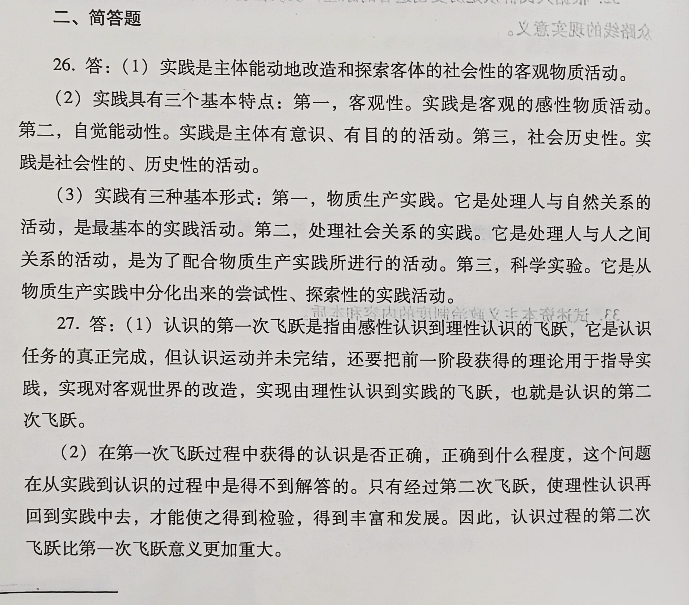
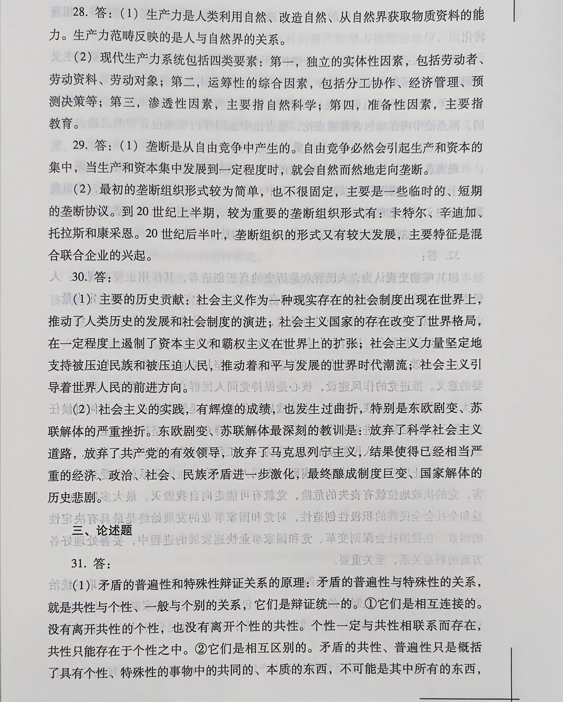
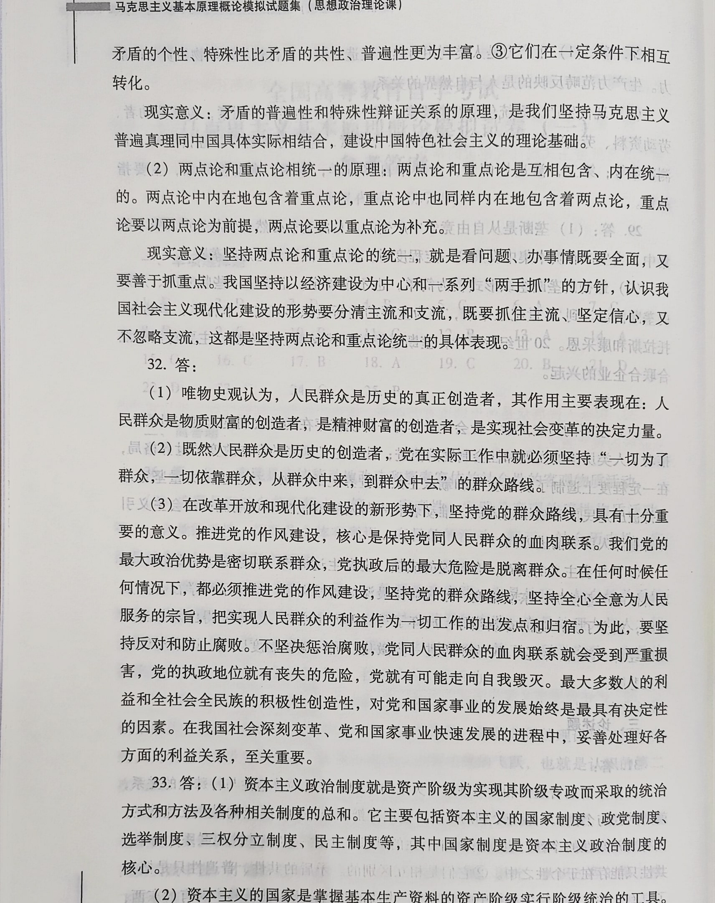
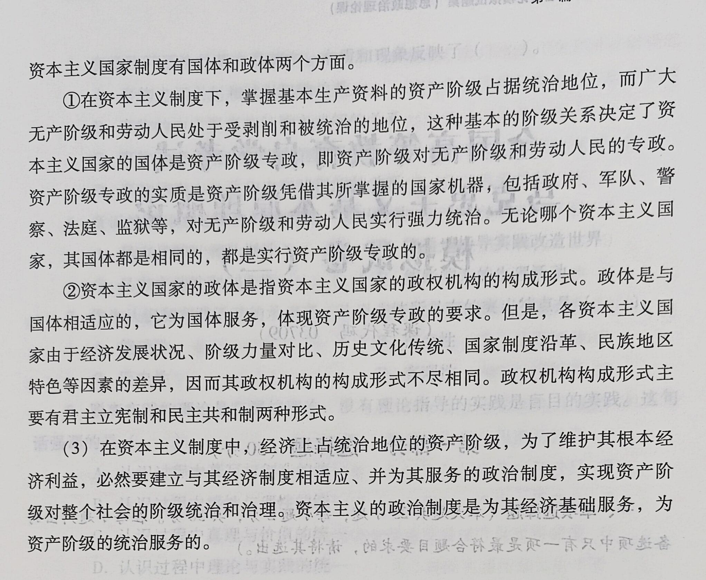

一、单项选择题

1．马克思主义的革命性与科学性统一的基础是

D.实践性 

2．唯物辩证法的实质与核心是（

` `D.对立统一规律

3．马克思主义中国化的最新成果是（

D.习近平新时代中国特色社会主义思想

4．“绝对运动中包含着相对静止，相对静止中包含着绝对运动”，这是一种(

B.唯物辩证法的观点

5．作为马克思、恩格斯一生最重要的理论发现，使社会主义从空想变成科学的是

C.唯物史观和剩余价值学说

6．在马克思主义指导下，从中国社会主义初级阶段的国情出发，走自己的路。这体现了（）。

A.矛盾的普遍性和特殊性的统一

7．循环论的错误在于（ ）。

C.夸大了事物发展的曲折性，否认了事物发展的前进性

8．下列各项中，属于辩证唯物主义认识论区别于旧唯物主义认识论的观点是(

D.实践是认识的基础的观点

9．理性认识的形式是（

C.概念、判断、推理

10．在真理观上坚持辩证法，就必须承认

B.真理既是绝对的又是相对的

11．马克思主义揭示了社会发展的客观规律，为无产阶级的革命斗争指明了方向，这说明（）。

C.科学理论对实践具有指导作用

12．地理环境在社会发展中的作用是（

B.影响社会发展的速度

13．下列各组社会意识形态中，全部属于非意识形态范围的是（）。

A.自然科学、逻辑学、语言学

14．划分经济社会形态所依据的标准是（）。

A.生产关系的性质

15．划分阶级的唯一标准是（

C.经济标准

16．简单商品经济的基本矛盾是指（

C.私人劳动和社会劳动的矛盾

17．从较长时期看，再生产劳动力所必需的消费资料的物质内容（

B.会不断扩大 C.会不断缩小

18．以厂房、设备的形式存在的资本属于（

A.不变资本

19．资本主义扩大再生产的重要源泉是（

C.资本积累

20．金融寡头在经济领域统治的实现手段主要是（

B.参与制

21．垄断利润的产生说明（ ）。

D.价值规律作用的形式发生了变化

22．当代资本主义国家在经济关系方面的一系列新变化表明（

D.其社会发生了阶段性的部分质变

23．苏维埃俄国开始实行新经济政策是在（ ）

` `C．1921年春

24．下列对马克思主义政党的理解，正确的一项是（

C.可以吸收其他阶级、阶层认同党纲、愿为其奋斗的人入党

25．共产主义社会制度具有巨大优越性的根本保证是（

B.创造出前所未有的高水平的劳动生产率

第二部分 非选择题（50分）

二、简答题

26．简述实践的含义及其基本特点和基本形式。

27．为什么说认识过程的第二次飞跃比第一次飞跃意义更加重大

28．简述生产力的含义及现代生产力系统的要素。

29．简述垄断的形成及垄断组织的主要形式。

30．简述社会主义从一国到多国发展的历史贡献与经验教训。

三、论述题

31．试述矛盾的普遍性和特殊性辩证关系的原理、两点论和重点论相统一的原理及其对社会主义现代化建设的指导意义。

32．根据人民群众是历史创造者的原理，谈谈在改革开放新形势下坚持党的群众路线的现实意义。

33．试述资本主义政治制度的内容和本质。

