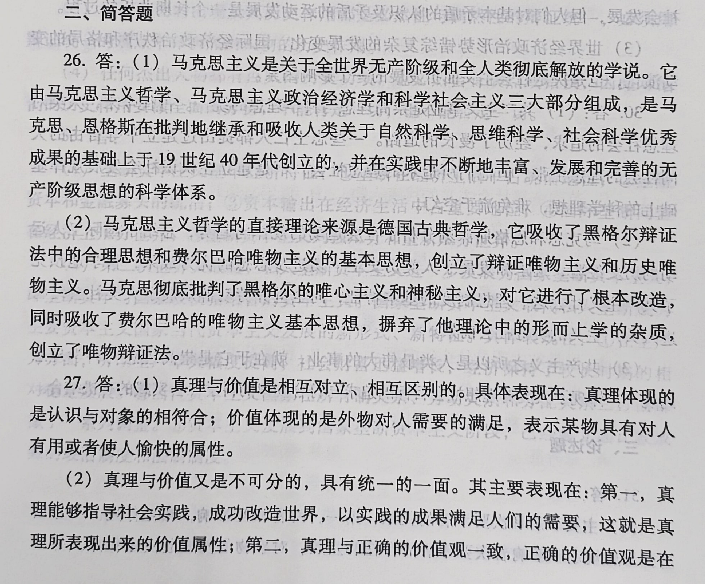
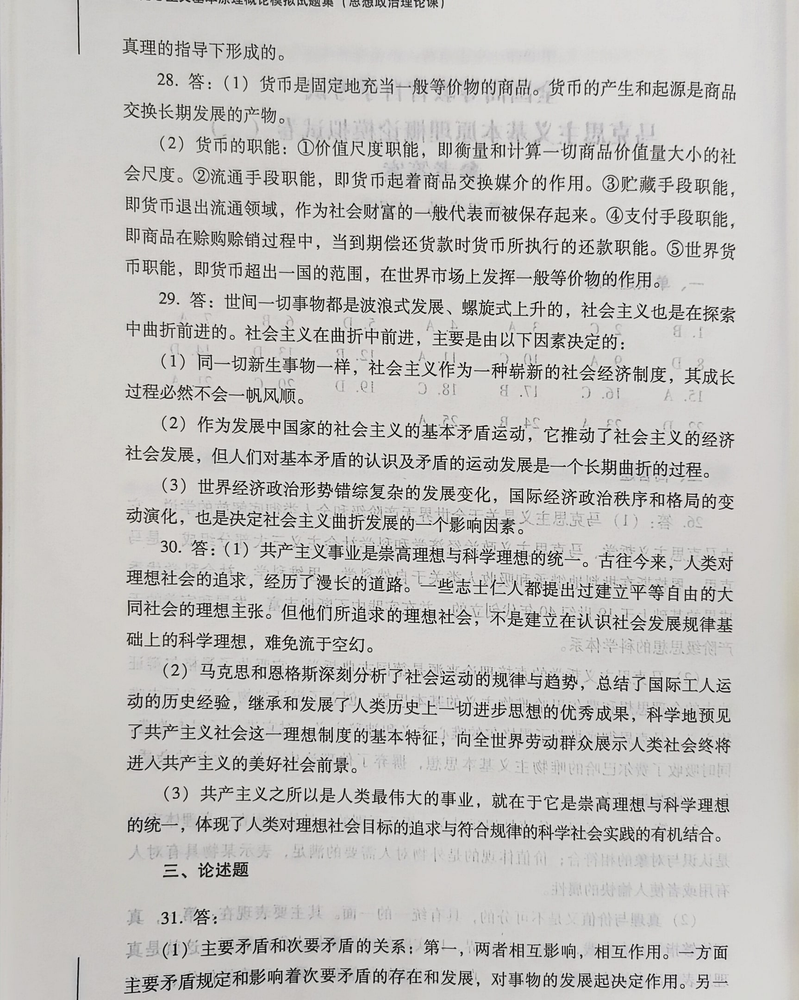
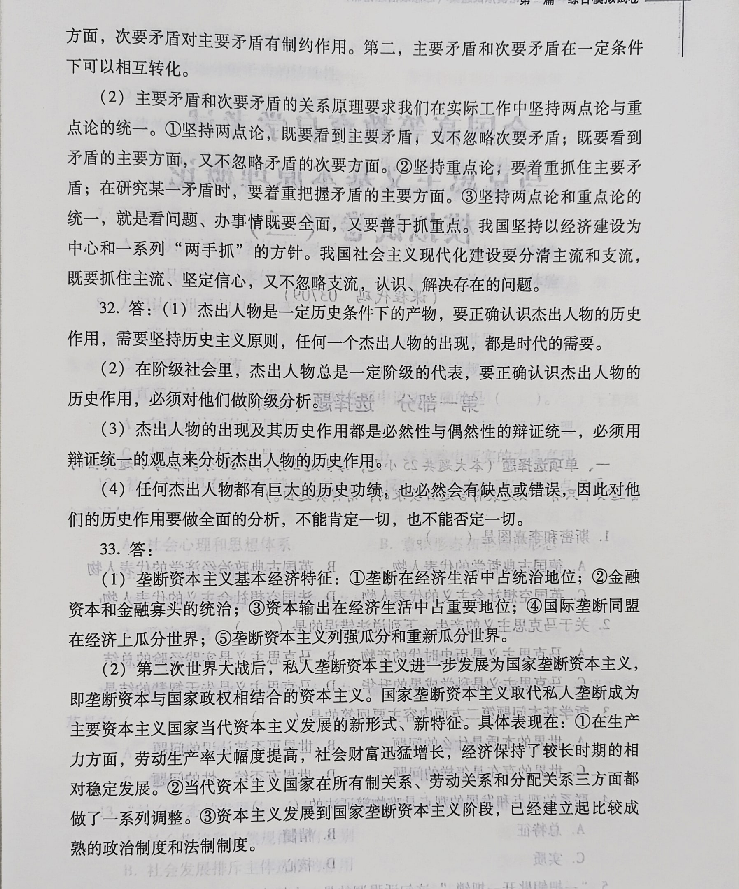

一、单项选择题

1．马克思主义是时代的产物。马克思、恩格斯所处的历史时代及其提出的各项任务，为马克思主义的产生提供了

B.客观条件 

2．马克思主义的革命性既表现为它具有彻底的批判精神，又表现为它具有( )。

C.鲜明的政治立场

3．唯物主义与唯心主义的区别在于如何回答（ ）。

A.世界的本质是什么问题

4．实践作为一种感性物质活动，强调的是（ ）。

A.实践具有客观性

5．在唯物辩证法的基本范畴中，本质和现象反映了（）

D.事物的根本性质和表面特征间的关系

6．意识的能动性最突出的表现是，意识活动（

B.能通过指导实践改造世界

7．作为认识和实践活动的承担者，认识主体所具有的突出特点是（

A.能动性

8．脱离实践的理论是空洞的理论，没有理论指导的实践是盲目的实践。这句话强调的是（）。D.认识过程中理论与实践的统一

9．坚持马克思主义哲学的认识路线，就必须在工作中坚持（）。

A.一切从实际出发

10．除了生产力与生产关系的矛盾，另一对社会基本矛盾是（

C.经济基础与上层建筑的矛盾

11．既承认历史发展的决定性又承认历史发展的选择性，这属于（

A.历史唯物论观点

2．阶级产生的根本前提是（

B.由于生产力的发展出现剩余产品

13．下列关于人的本质的说法中，不正确的是（）。

D.人的本质是人人相同的

14．两种商品可以按一定比例相互交换的原因，在于它们（）。

D.在生产中都耗费了一般人类劳动

15．由提高劳动强度而生产的剩余价值属于（

A.绝对剩余价值

16．产业资本的循环运动（）。

C.是购买、生产、销售三个阶段的统一

17．资本主义政治制度的核心是（）。

B.国家制度 

18\.20世纪下半叶，从第二次世界大战结束后到冷战结束前，西方主要发达资本主义国家处于（）。

C.国家垄断资本主义阶段

19．垄断资本实现其经济上统治的方式是（）。

D.参与制 

20．垄断组织实行垄断价格的根本目的是（ ）。

C.获取高额垄断利润

21．下列选项中不属于当代资本主义生产关系方面新变化的是（）。

A.在生产管理方面，出现了一系列运用电子计算机等新技术的管理手段和工具

22\.19世纪初期欧洲的空想社会主义者不包括（ ）。

D.英国的莫尔 

23．社会主义的根本的和首要的任务是（ ）。

A.解放和发展生产力

24．马克思主义政党产生的条件有二：一是工人运动的发展，一是（

B.科学社会主义理论的传播

25．集中体现着共产主义社会主要特征和本质要求的原则标志是（

A.各尽所能，按需分配

二、简答题

26．什么是马克思主义？简述马克思主义对德国古典哲学的继承与创新。

27．简述真理与价值的对立统一。

28．简述货币的本质及其职能。一

29．列宁指出：“设想社会历史会一帆风顺、按部就班地向前发展，不会有时出现大幅度的跃退，那是不辩证的，不科学的，在理论上是不正确的。”社会主义也同样是在探索中曲折前进的。你对此如何理解？

30．为什么说实现共产主义是人类最伟大的事业？

三、论述题

31．试述主要矛盾和次要矛盾关系的原理及其对实际工作的指导意义。

32．试述如何正确分析和评价杰出人物在历史上的作用。

33．垄断资本主义的基本经济特征有哪些？其在当代发展的新特点、新形式是什么？

